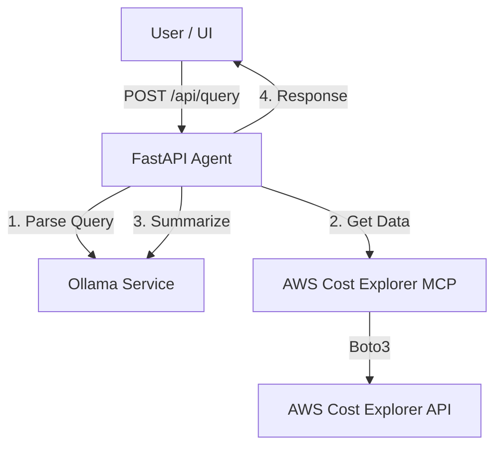

# FinOps AI Agent with AWS Cost Explorer

This is a FastAPI-based AI agent that helps you analyze your AWS costs using natural language. It connects to the **AWS Cost Explorer MCP Server** to fetch real data and uses **Ollama** for natural language understanding and summarization.

## 🏗️ Architecture

The agent acts as an orchestrator between the user, the LLM, and the AWS environment:

1.  **FastAPI Agent**: The core application (`agent_orchestrator.py`) that handles API requests.
2.  **Ollama LLM**: Used for two purposes:
    *   **Intent Extraction**: Parses your question (e.g., "costs last month") into structured data (dates, filters).
    *   **Summarization**: Takes the raw JSON data from AWS and turns it into a human-readable summary.
    *   *Model*: Uses `qwen2.5-coder:7b` hosted on the tirescorp enterprise Ollama service.
3.  **MCP Client**: Connects to the AWS Cost Explorer MCP server using the Model Context Protocol.
    *   *Connection*: Runs the MCP server as a subprocess directly via Python (`python -m awslabs...`) to avoid Windows permission issues.
    *   *Data*: Fetches cost, usage, and forecast data securely using your local AWS credentials.



## 🚀 Setup Instructions

### 1. Prerequisites
*   Python 3.10+
*   Access to enterprise Ollama service
*   AWS CLI installed

### 2. Installation
Clone the repository and navigate to the agent directory:

```powershell
cd agent
```

Create and activate a virtual environment:

```powershell
python -m venv .venv
.\.venv\Scripts\activate
```

Install dependencies (this includes the MCP server):

```powershell
pip install -r requirements.txt
pip install uv
pip install awslabs.cost-explorer-mcp-server
```

### 3. AWS Authentication
The agent supports two authentication modes:

#### Mode A: EC2 instance profile
Use this when the app is running on an EC2 instance that already has an attached IAM role / instance profile.

How it works:
*   boto3 automatically uses the EC2 instance profile.
*   If `AWS_TARGET_ROLE_ARN` is set, the agent calls STS `AssumeRole` with those instance-profile credentials before launching the MCP server.
*   The MCP server then uses the temporary credentials for billing queries.

What to do:
*   Leave `AWS_PROFILE` unset.
*   Keep `AWS_TARGET_ROLE_ARN` set if you need to read billing data through a cross-account role.

#### Mode B: AWS SSO profile
Use this when the app is running on a machine that does not have an EC2 instance profile.

How it works:
*   You configure an AWS CLI SSO profile once.
*   You run `aws sso login --profile <profile-name>`.
*   You set `AWS_PROFILE=<profile-name>` before starting the agent.
*   boto3 uses the cached SSO session.
*   If `AWS_TARGET_ROLE_ARN` is set, the agent assumes that target role using the SSO-backed session.

One-time setup:

```powershell
aws configure sso --profile my-sso-profile
aws sso login --profile my-sso-profile
```

When the SSO session expires, run the login command again.

### 4. Configuration
Create a `.env` file in the `agent` directory:

```env
# Ollama Configuration
OLLAMA_BASE_URL=https://ollama.services.tirescorp.com
OLLAMA_MODEL=qwen2.5-coder:7b
OLLAMA_TIMEOUT=120

# MCP Server Configuration
# We use direct module execution to bypass Windows security restrictions
MCP_SERVER_COMMAND=C:\Users\fshaikh\finops\agent\.venv\Scripts\python.exe
MCP_SERVER_ARGS=-m awslabs.cost_explorer_mcp_server.server

# AWS Credentials
AWS_REGION=us-west-2
# Leave this unset on EC2. Set it only when using AWS SSO on a non-EC2 machine.
#AWS_PROFILE=my-sso-profile
AWS_TARGET_ROLE_ARN=arn:aws:iam::307127115570:role/tao-billing-readonly-cross-account-role

# API Configuration
API_HOST=0.0.0.0
API_PORT=8000
LOG_LEVEL=INFO
```

## 🏃‍♂️ Running the Agent

Always run the agent **from the `agent` directory**:

```powershell
# 1. Activate venv
.\.venv\Scripts\activate

# 2. Start the server
python -m uvicorn main:app --host 0.0.0.0 --port 8000
```

You should see logs indicating successful startup and connection to Ollama.

### Which mode should I use?
Use EC2 instance profile mode when the app is deployed on EC2 and the instance already has permission to reach the billing account or assume the target billing role.

Use AWS SSO mode when the app is running anywhere else. In that case:

```powershell
aws sso login --profile my-sso-profile

aws sso login  --profile DtcBillingReadOnly-307127115570
```

Then make sure `AWS_PROFILE=my-sso-profile` is set before you start the agent.

## Health Check

**Endpoint**: `GET http://localhost:8000/health`

## Swagger UI

**Endpoint**: `GET http://localhost:8000/docs`


## 🧪 Usage

**Endpoint**: `POST http://localhost:8000/api/query`

**Payload:**
```json
{
  "query": "What were my AWS costs last month?"
}
```

**PowerShell Example:**
```powershell
$body = @{ query = "Show me cost breakdown by service for last month" } | ConvertTo-Json
Invoke-WebRequest -Uri http://localhost:8000/api/query -Method POST -Body $body -ContentType "application/json"
```

## 🔧 Troubleshooting

**"Access Denied" / "Connection Closed" Errors:**
*   Ensure you are using the full path to `python.exe` in `MCP_SERVER_COMMAND`.
*   If running on EC2, verify the instance profile has permission to `AssumeRole` on the target cross-account role.
*   If running outside EC2, verify `AWS_PROFILE` matches the profile you used with `aws sso login`.
```
aws configure sso
SSO session name (Recommended): tao
SSO start URL [None]: http://d-9267957955.awsapps.com/start/#/?container=aws
SSO region [None]: us-west-2
SSO registration scopes [sso:account:access]:
Attempting to open your default browser.
If the browser does not open, open the following URL:
```
*   If running outside EC2, re-run `aws sso login --profile <profile-name>` if your SSO session expired.
*   Check the `AWS_TARGET_ROLE_ARN` in your `.env` file.

**"Model not found" Error:**
*   Check `OLLAMA_MODEL` in `.env`. It should be `qwen2.5-coder:7b`.
