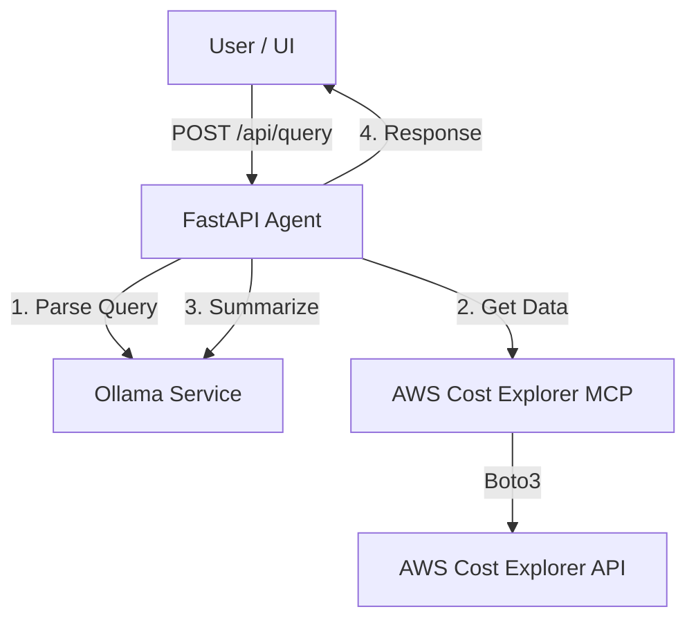

# FinOps AI Agent with AWS Cost Explorer

This is a FastAPI-based AI agent that helps you analyze your AWS costs using natural language. It connects to the **AWS Cost Explorer MCP Server** to fetch real data and uses **Ollama** for natural language understanding and summarization.

## 🏗️ Architecture

The agent acts as an orchestrator between the user, the LLM, and the AWS environment:

1.  **FastAPI Agent**: The core application (`agent_orchestrator.py`) that handles API requests.
2.  **Ollama LLM**: Used for two purposes:
    *   **Intent Extraction**: Parses your question (e.g., "costs last month") into structured data (dates, filters).
    *   **Summarization**: Takes the raw JSON data from AWS and turns it into a human-readable summary.
    *   *Model*: Uses `qwen2.5-coder:7b` hosted on the tirescorp enterprise Ollama service.
3.  **MCP Client**: Connects to the AWS Cost Explorer MCP server using the Model Context Protocol.
    *   *Connection*: Runs the MCP server as a subprocess directly via Python (`python -m awslabs...`) to avoid Windows permission issues.
    *   *Data*: Fetches cost, usage, and forecast data securely using your local AWS credentials.



## 🚀 Setup Instructions

### 1. Prerequisites
*   Python 3.10+
*   Access to enterprise Ollama service
*   AWS CLI installed

### 2. Installation
Clone the repository and navigate to the agent directory:

```powershell
cd agent
```

Create and activate a virtual environment:

```powershell
python -m venv .venv
.\.venv\Scripts\activate
```

Install dependencies (this includes the MCP server):

```powershell
pip install -r requirements.txt
pip install awslabs.cost-explorer-mcp-server
```

### 3. AWS Authentication (SSO)
The agent uses your local AWS credentials. Configure SSO login:

```powershell
aws configure sso
```

Enter the following values when prompted:
*   **SSO start URL**: `http://d-9267957955.awsapps.com/start/#/?container=aws`
*   **SSO Region**: `us-west-2`
*   **SSO registration scopes**: [Leave default]
*   **CLI Profile Name**: `financial-profile` (or any name you prefer)

**Login to AWS:**
Every day, you must login to refresh your credentials:
```powershell
aws sso login --profile DtcReadOnly-017521386069
```

### 4. Configuration
Create a `.env` file in the `agent` directory:

```env
# Ollama Configuration
OLLAMA_BASE_URL=https://ollama.services.tirescorp.com
OLLAMA_MODEL=qwen2.5-coder:7b
OLLAMA_TIMEOUT=120

# MCP Server Configuration
# We use direct module execution to bypass Windows security restrictions
MCP_SERVER_COMMAND=C:\Users\fshaikh\finops\agent\.venv\Scripts\python.exe
MCP_SERVER_ARGS=-m awslabs.cost_explorer_mcp_server.server

# AWS Credentials (optional, if not using default profile)
AWS_PROFILE=financial-profile
AWS_REGION=us-east-1

# API Configuration
API_HOST=0.0.0.0
API_PORT=8000
LOG_LEVEL=INFO
```

## 🏃‍♂️ Running the Agent

Always run the agent **from the `agent` directory**:

```powershell
# 1. Activate venv
.\.venv\Scripts\activate

# 2. Start the server
python -m uvicorn main:app --host 0.0.0.0 --port 8000
```

You should see logs indicating successful startup and connection to Ollama.

## Health Check

**Endpoint**: `GET http://localhost:8000/health`

## Swagger UI

**Endpoint**: `GET http://localhost:8000/docs`


## 🧪 Usage

**Endpoint**: `POST http://localhost:8000/api/query`

**Payload:**
```json
{
  "query": "What were my AWS costs last month?"
}
```

**PowerShell Example:**
```powershell
$body = @{ query = "Show me cost breakdown by service for last month" } | ConvertTo-Json
Invoke-WebRequest -Uri http://localhost:8000/api/query -Method POST -Body $body -ContentType "application/json"
```

## 🔧 Troubleshooting

**"Access Denied" / "Connection Closed" Errors:**
*   Ensure you are using the full path to `python.exe` in `MCP_SERVER_COMMAND`.
*   Verify you have run `aws sso login`.
*   Ensure `awslabs.cost-explorer-mcp-server` is installed in your `.venv`.

**"Model not found" Error:**
*   Check `OLLAMA_MODEL` in `.env`. It should be `qwen2.5-coder:7b`.
